## Lab 1 - Preparando o nosso ambiente com Resource Manager
Nesse laboratório prepararemos a infraestrutura base do workshop, onde criaremos os seguintes serviços:

 - **Compartimento:** Separação lógica de recursos dentro da cloud. O compartimento tem função fundamental no controle de políticas de acesso, governança, e controle de custos dentro da tenancy:[https://docs.oracle.com/pt-br/iaas/Content/Identity/Tasks/managingcompartments.htm](https://docs.oracle.com/pt-br/iaas/Content/Identity/Tasks/managingcompartments.htm)
 - **Resource Manager Stack:** Stack de códigos de terraform que serão usados no workshop:[https://docs.oracle.com/pt-br/iaas/Content/ResourceManager/Concepts/resourcemanager.htm](https://docs.oracle.com/pt-br/iaas/Content/ResourceManager/Concepts/resourcemanager.htm)
 - **Dynamic Groups:** Os grupos dinâmicos permitem que você grupo instâncias de computação do Oracle Cloud Infrastructure como atores "principais" (similares aos grupos de usuários):[https://docs.oracle.com/pt-br/iaas/Content/Identity/Tasks/managingdynamicgroups.htm](https://docs.oracle.com/pt-br/iaas/Content/Identity/Tasks/managingdynamicgroups.htm)
 - **Políticas de acesso:** [https://docs.oracle.com/pt-br/iaas/Content/Identity/Concepts/policygetstarted.htm](https://docs.oracle.com/pt-br/iaas/Content/Identity/Concepts/policygetstarted.htm)
 - **Virtual Cloud Network:** Rede virtual em nuvem.[https://docs.oracle.com/pt-br/iaas/Content/Rover/Network/VCN/vcn_management.htm#VCNManagement](https://docs.oracle.com/pt-br/iaas/Content/Rover/Network/VCN/vcn_management.htm#VCNManagement)
 - **OCI Streaming Service:** Serviço de streaming compativel a modelo kafka (publish - subscribe)[https://docs.oracle.com/pt-br/iaas/Content/Streaming/Concepts/streamingoverview.htm](https://docs.oracle.com/pt-br/iaas/Content/Streaming/Concepts/streamingoverview.htm)
 - **Object Storage:** [https://docs.oracle.com/pt-br/iaas/Content/Object/Concepts/objectstorageoverview.htm#Overview_of_Object_Storage](https://docs.oracle.com/pt-br/iaas/Content/Object/Concepts/objectstorageoverview.htm#Overview_of_Object_Storage)
 - **Container Registry:** Registro de containers similiar ao Docker Hub.[https://docs.oracle.com/pt-br/iaas/Content/Registry/Concepts/registryoverview.htm](https://docs.oracle.com/pt-br/iaas/Content/Registry/Concepts/registryoverview.htm)
 
#### Criando o compartimento
1. Acesse a console da cloud: [https://www.oracle.com/cloud/sign-in.html](https://www.oracle.com/cloud/sign-in.html)

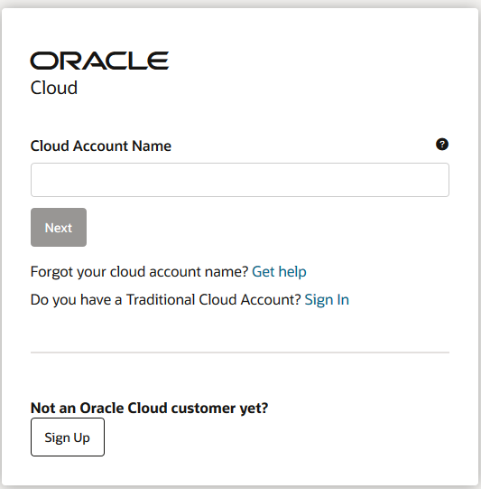

2. Insira o nome da sua tenancy no campo de **Cloud Account Name**

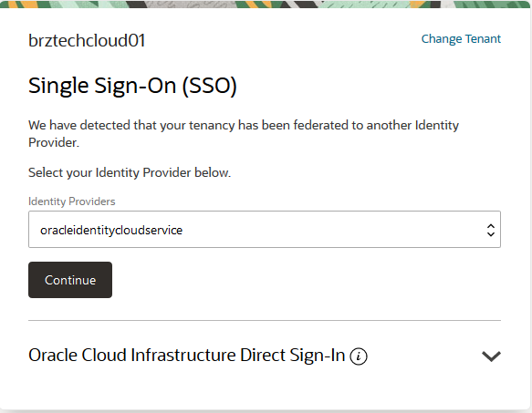

3. Clique no botão **Continue** para ir para a página de login.

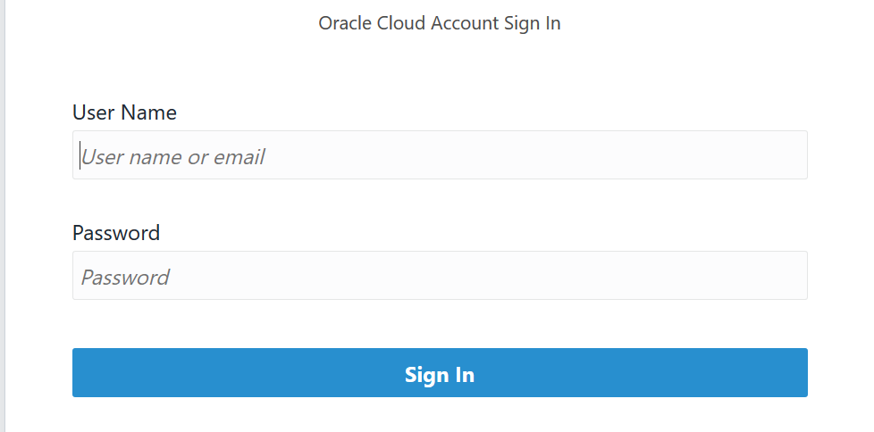

4. Insira seu usuario/senha e clique em **Sing In**

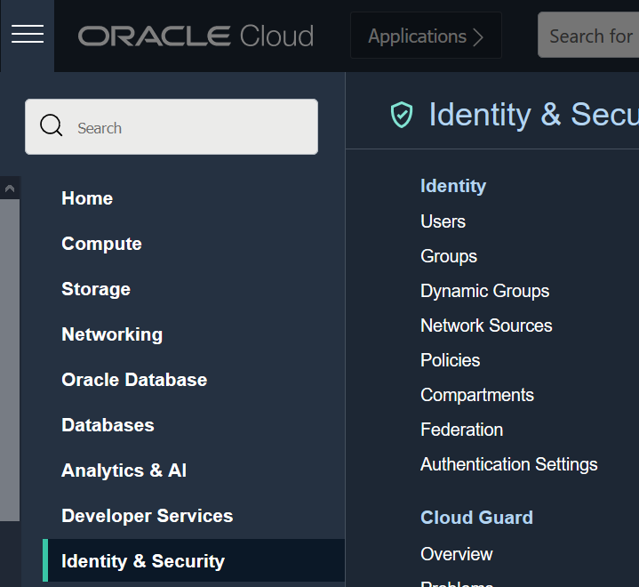

5. Acesse o **menu no canto esquerdo superior**, em **Identidade & Segurança** (Identity & Security), clique em **Compartimentos** (Compartments).

6. Clique em Criar Compartimento (Create Compartment).

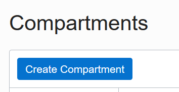

7. Preencha os seguintes campos:

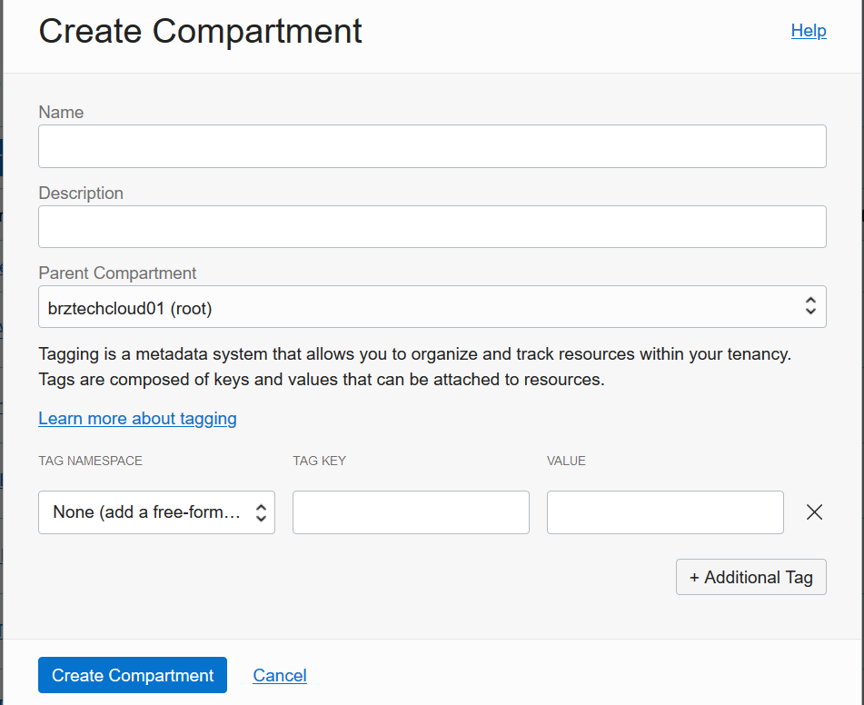

- **Name:** < Defina um nome para o compartimento >
- **Description:** < Defina uma descrição para o compartimento >
- **Parent Compartment:**  Selecione o compartimento sinalizado como **(root)**
8. Clique em **Create Compartment**
9. Aguarde um breve momento, e atualize a página do navegador para que a mudança seja refletida.
####  Coletando informações necessárias
10. Selecione o compartimento recém criado

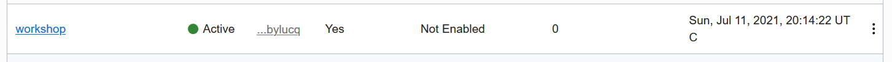

11. Na página do compartimento, copie as informações de **Nome** e **OCID** para um bloco de notas.

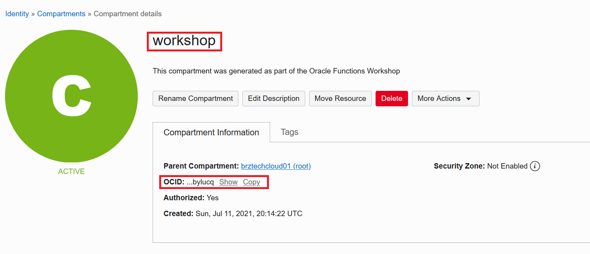

####  Criando a Stack e Job de Apply
12. Acesse o menu no canto esquerdo superior, em **Serviços de Desenvolvimento** (Developer Services), clique em **Pilhas** (Stacks)

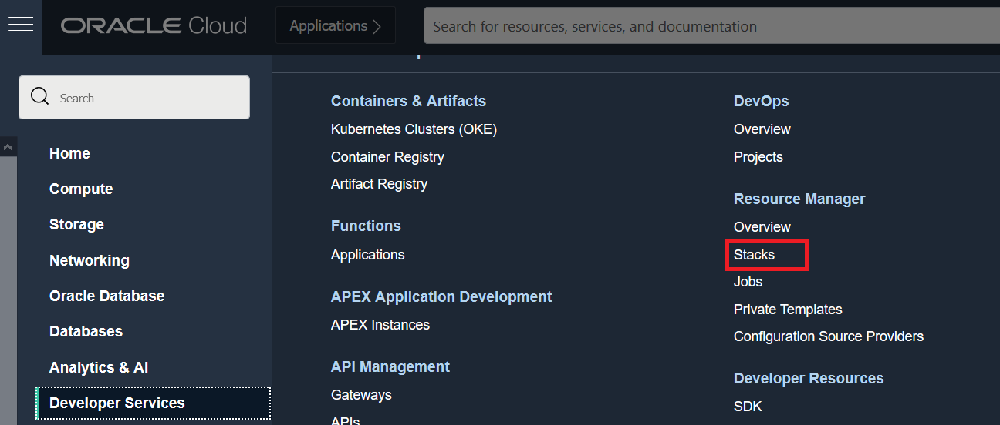

13. No canto esquerdo inferior, em **Escopo** (List Scope), selecione o compartimento recém criado. *Se caso o compartimento não estiver listado, basta atualizar a página do navegador*

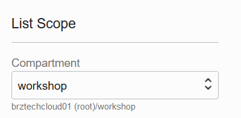

14. Faça o [Download](https://github.com/gustavogaspar/events-function/raw/main/terraform.zip) do ".zip" de configuração contendo o manifesto terraform (Não é necessária a extração do arquivo). 
15. Clique em **Criar Pilha** (Create Stack)

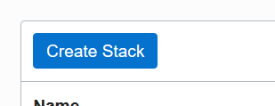

16. Preencha o formulário conforme abaixo:

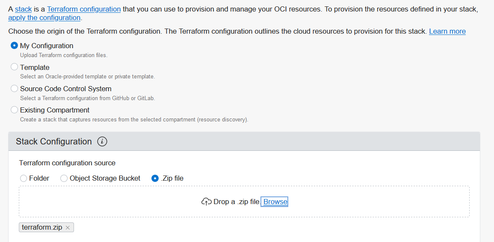

- Selecione **Minha Configuração** (My Configuration)
- Em **Configuração de Pilha** (Stack Configuration), selecione **Arquivo .zip** e faça o upload do .zip de configuração coletado no passo **14** deste guide.
17. Clique em **Próximo** (Next)
18. Preencha o formulário com as seguintes informações:

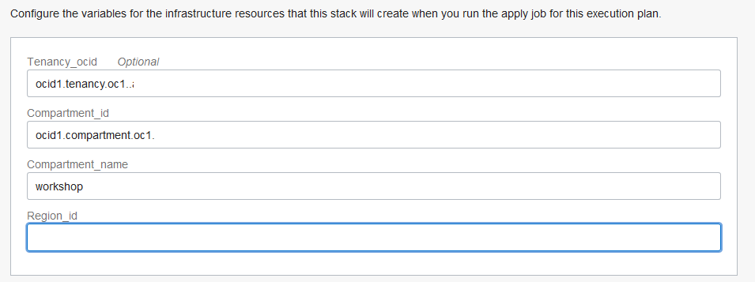

- Tenancy_ocid: (**Manter valor apresentado**)
- Compartment_id: Preencha com a informação de **OCID** coletada no passo **11**
- Compartment_name: Preencha com a informação de **Nome** coletada no passo **11**
- Region_key: Este campo deve ser preenchido de acordo com a chave da sua **região em letras minúsculas**. Para saber a chave referente a sua região utilize a coluna de **Region Key**, na lista de regiões presentes no link: [https://docs.oracle.com/en-us/iaas/Content/General/Concepts/regions.htm](https://docs.oracle.com/en-us/iaas/Content/General/Concepts/regions.htm).
19. Clique em **Próximo** (Next)
20. Selecione a checkbox **Run Apply** e clique em **Criar**

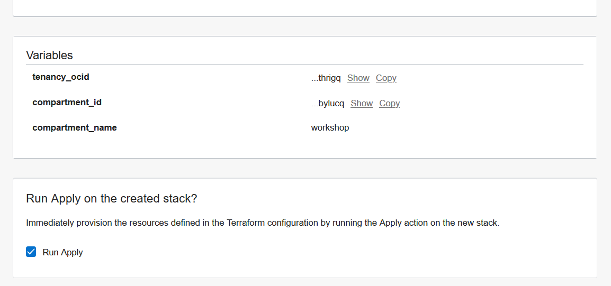

21. Aguarde a conclusão e vá ao próximo laboratório.

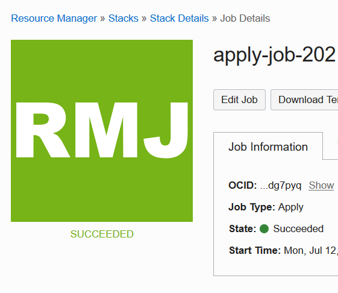

[<--------RETORNAR](../README.md)         

[AVANÇAR-------->](../LAB02/README.md)
