## Criando sua Function e configurando ambiente de Cloud Shell

 Nesse laboratório criaremos nossa primeira aplicação na plataforma functions, onde faremos o deploy da função responsável por coletar e enviar o conteúdo de um arquivo em object storage. Também utilizaremos o recurso de Cloud Shell para gerenciar/testar nossa função.
 Para essa tarefa utilizaremos os seguintes recursos:
 
 - **Oracle Functions:** [https://docs.oracle.com/pt-br/iaas/Content/Functions/Concepts/functionshowitworks.htm](https://docs.oracle.com/pt-br/iaas/Content/Functions/Concepts/functionshowitworks.htm)
 - **Cloud Shell:** [https://docs.oracle.com/pt-br/iaas/Content/API/Concepts/cloudshellintro.htm](https://docs.oracle.com/pt-br/iaas/Content/API/Concepts/cloudshellintro.htm)
 

#### Coletando Informações Necessárias
1. No canto direito superior clique no **icone de perfil**, e em seguida selecione **seu usuário**, conforme imagem abaixo:

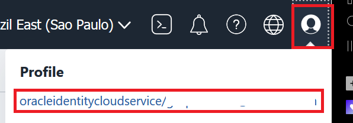

2. No canto esquerdo inferior, abaixo de **Recursos** (Resources) selecione **Auth Tokens**

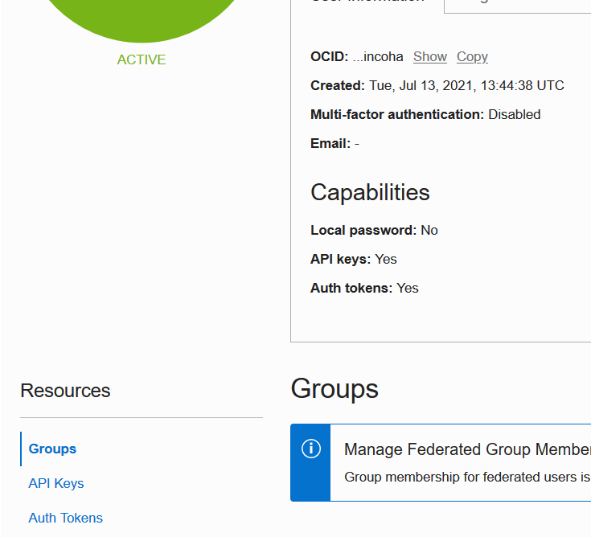

3. Clique em **Gerar Token** (Generate Token).

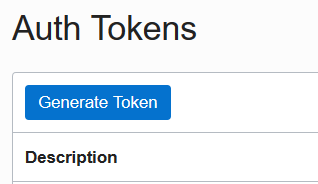

4. Escreva uma descrição da sua preferência para o token, e clique em **Gerar Token** (Generate Token).

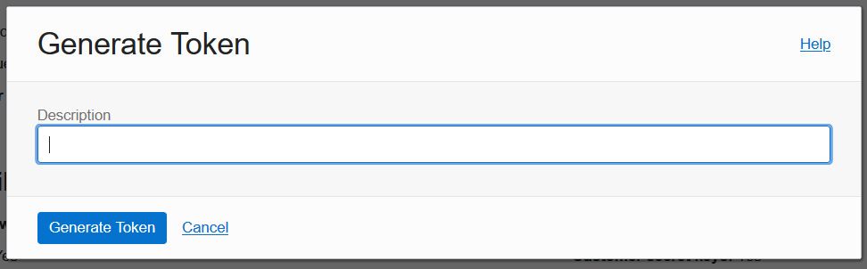

5. **[IMPORTANTE]** Copie o token gerado para um bloco de notas, esse token não será mostrado novamente.

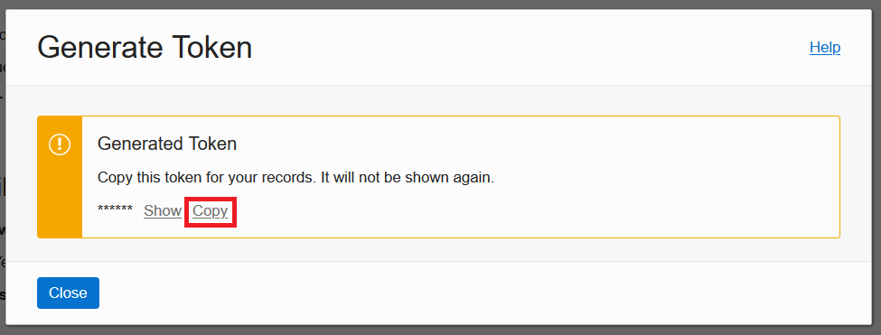

6. Clique em **Fechar** (Close)

#### Criando a Function Application
7. Abra o menu no canto superior esquerdo, em **Serviços de Desenvolvimento** (Developer Services), selecione **Functions**

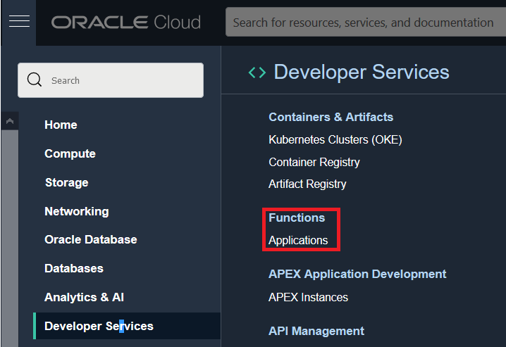

8. No canto esquerdo inferior verifique se o **compartimento** que você esta utilizando para esse laboratório esta selecionado.

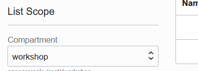

9. Clique em **Criar Aplicação** (Create Application).

10. No Formulario de Nova Aplicação preencha:
- Nome: < Defina um nome pra sua função >
- VCN: Selecione **vcn_workshop**
- Subnets: Selecione a **subnet_workshop**

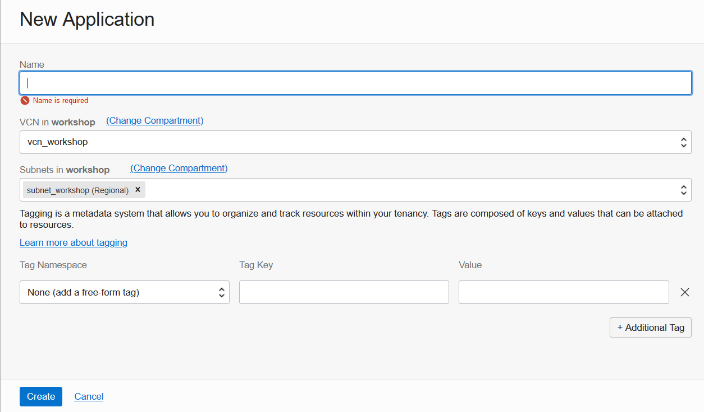

11. Clique em **Criar** (Create)
####  Configurando Ambiente de Cloud Shell
12. Na página da aplicação criada, seguiremos o guide gerado pela propria plataforma para configurar o cloud shell.
13. Para acessar o guide, clique em **Conceitos Básicos** (Getting Started) no canto inferior esquerdo.

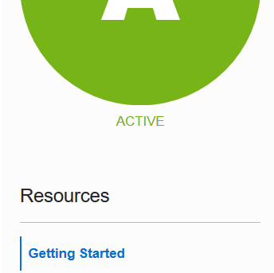

14. Selecione a opção de **Configuração do Cloud Shell** (Cloud Shell Setup).

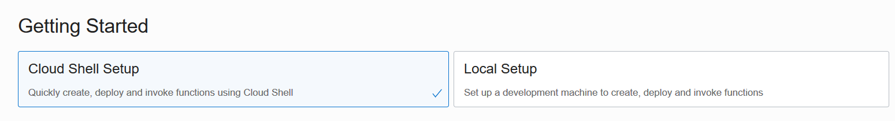

15. Execute os passos **1,2 e 3** do guide sem nenhuma alteração:

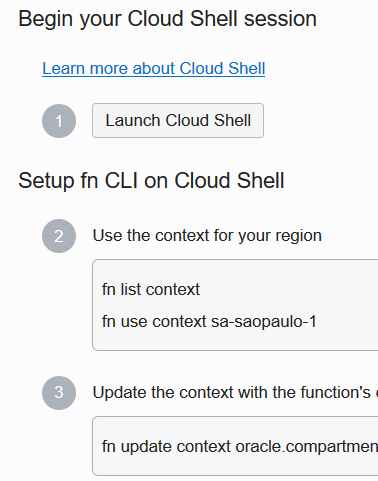

16. Execute o passo **4** substituindo **[OCIR-REPO]** por **workshop** conforme exemplo abaixo:

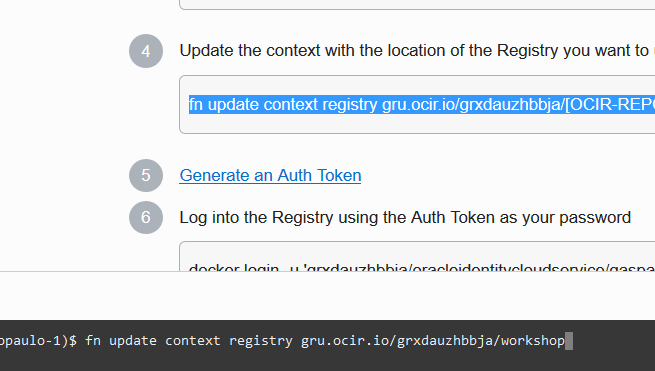

17. Pularemos o passo **5** visto que já geramos o Auth token anteriormente.
18. Execute o passo **6**, e ao ser solicitada a informação de **password**, insira a informação de **Auth Token gerada no passo 3 deste laboratório**.

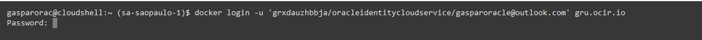

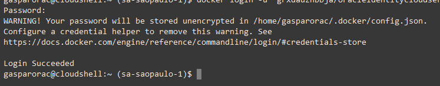

19. Execute o passo **7** para validar se a configuração foi realizada com sucesso.

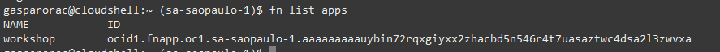

####  Realizando o Deploy da Função
 20. Ainda utilizando o Cloud Shell, clone o repositório da função que vamos utilizar nesse workshop:
 

    $ git clone https://github.com/gustavogaspar/events-function.git

 21. Entre na pasta do projeto
 

    $ cd events-function

22. Execute o comando de deploy, substituindo a informação de **[APP-NAME]** pelo **nome da sua aplicação criada no passo 11 deste laboratório**. (Você pode utilizar o comando apresentado no passo 10 da guia de Conceitos Basicos (Getting Started). _Esse processo pode levar bastante tempo_

   $  fn -v deploy --app [APP-NAME]

23. Execute o comando abaixo, para chamar a função e validar se ela foi criada corretamente: 

   $ fn invoke [APP-NAME] final-workshop

24. O Retorno esperado é: **{"message":"No event"}**

[<--------RETORNAR](../LAB01/README.md) 

[AVANÇAR-------->](../LAB03/README.md)

