## Criando a Regra de Eventos e testando o funcionamento do fluxo

Nesse laboratório criaremos nossa regra que irá mapear eventos de criação em nosso object storage, e ativará a função que criamos no laboratório anterior.
Para essa tarefa utilizaremos os seguintes recursos:
 
 - **Oracle Events:** [https://docs.oracle.com/pt-br/iaas/Content/Events/Concepts/eventsoverview.htm](https://docs.oracle.com/pt-br/iaas/Content/Events/Concepts/eventsoverview.htm)

#### Criando regra de evento
1. Acesse o menu no canto superior esquerdo, em **Observability & Management**, clique em **Serviço Events** (Events Service).

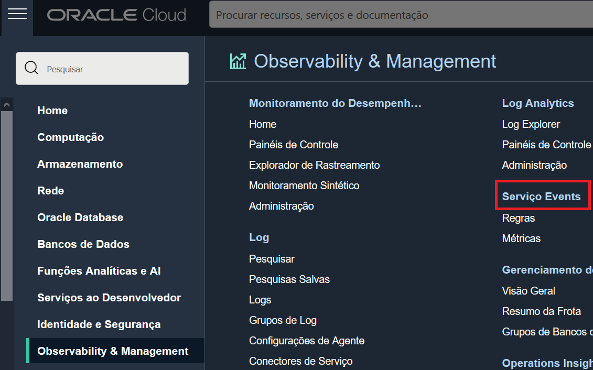

2. No canto esquerdo inferior verifique se o **compartimento** que você esta utilizando para esse laboratório esta selecionado.

3. Clique em **Criar Regra** (Create Rule).

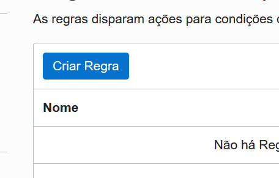

4. Preencha o formulário de regra da seguinte forma:
- Nome para Exibição: < Defina um nome para regra >
- Descrição: < Defina uma descrição para a regra >
- **Condições da Regra:**
- Condição: "Tipo de Evento"
- Nome do Serviço: "Object Storage"
- Tipo de Evento: "Object Create"

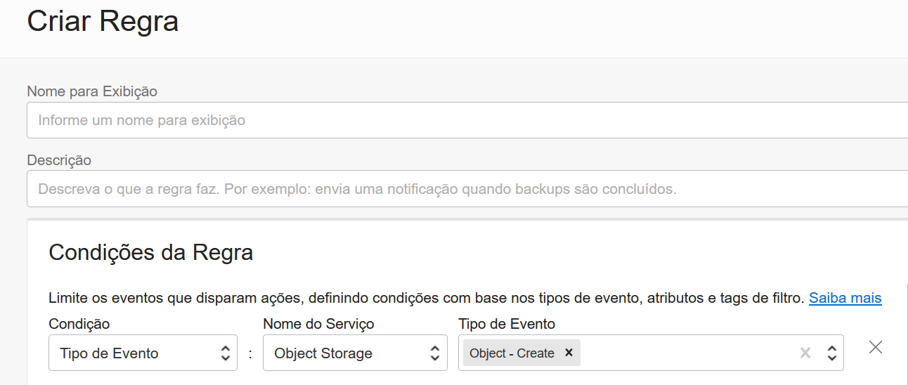

- **Ações:**
- Tipo de Ação: "Funções"
- Compartimento da Função: < Selecione o compartimento da função criada no lab anterior>
- Aplicativo de Função: < Selecione o aplicativo de função criado no lab anterior >
- Função: "final-workshop"

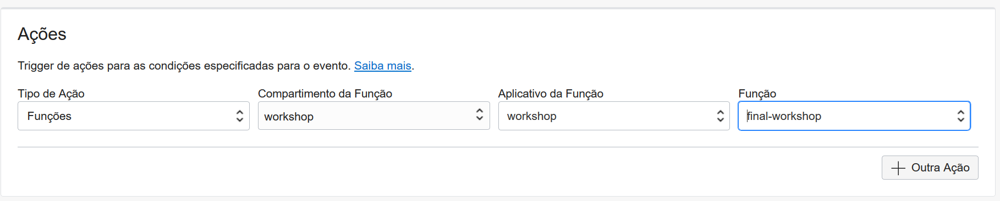

5. Clique em **Criar** (Create)

#### Testando o funcionamento do fluxo

Agora que temos o fluxo criado, podemos testar sua funcionalidade, para isso abriremos uma nova aba no navegador, onde acessaremos a nossa stream, e na nossa aba principal iremos fazer o teste de criação de um arquivo **.txt** em nosso bucket.

##### Nova Aba
1. Acesse a console da cloud: [https://www.oracle.com/cloud/sign-in.html](https://www.oracle.com/cloud/sign-in.html)
2. Insira o nome da sua tenancy no campo de **Cloud Account Name**
3. Clique no botão **Continue** para ir para a página de login.
4. Insira seu usuario/senha e clique em **Sing In** *(Se o seu navegador já possui uma sessão ativa, esse passo provavelmente não será necessário)*
5. No menu no canto esquerdo superior, em **Funções Analíticas e AI** (Analytics & AI), selecione Mensagens (Messaging)

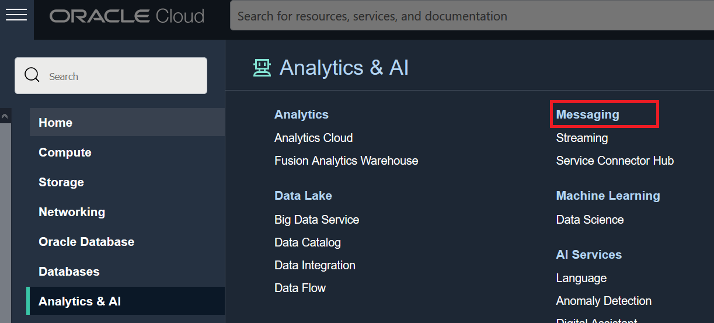

6. No canto esquerdo inferior verifique se o **compartimento** que você esta utilizando para esse laboratório esta selecionado.

7. Você observará que um **fluxo** (stream) já estará criado neste compartimento com o nome de **"workshop"** . *Este fluxo foi criado durante o primeiro laboratório, onde executamos o código de terraform através do resource manager*.

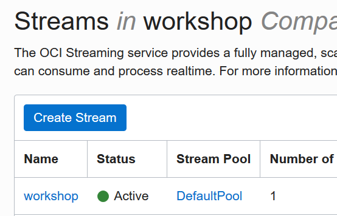

8. Selecione o fluxo **"workshop"**
9. **Mantenha a aba aberta,** e volte para a aba principal do seu navegador

 ##### Aba Principal
 1. No menu no canto esquerdo superior, em **Armazenamento** (Storage), acesse **Buckets**
 
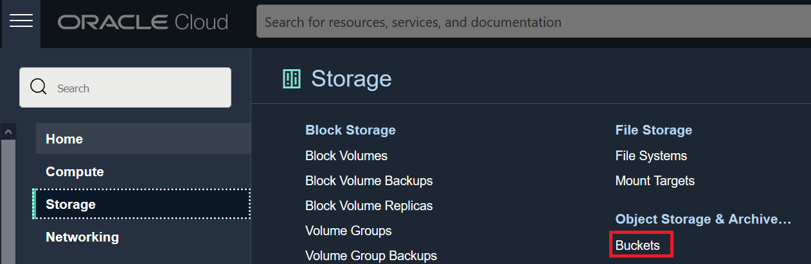

 2. No canto esquerdo inferior verifique se o **compartimento** que você esta utilizando para esse laboratório esta selecionado.
 

 3. Você observará que um **Bucket** já estará criado neste compartimento com o nome de **"workshop_bucket"**.
 
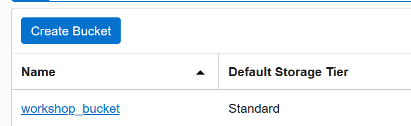

 4. Selecione o bucket **"workshop_bucket"**.
 5. A emissão de eventos a partir de um bucket é opcional, podendo ser habilitada ou desabilitada a qualquer momento.Valide se a **emissão de eventos** (Emit Object Events) está habilitada para este bucket.
 
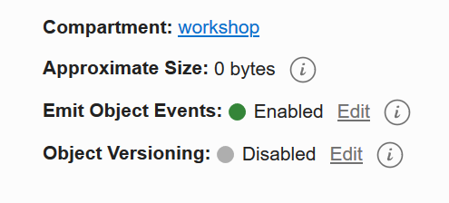

 6. Estamos prontos para realizar o teste, mantenha a aba principal aberta.

##### Teste

1. Crie um arquivo de formato **.txt** em seu computador local, com o conteúdo de sua preferência.  *(O formato .txt utf-8 não é obrigatório, porém todos os testes realizados nesse workshop foram considerando esse formato)*

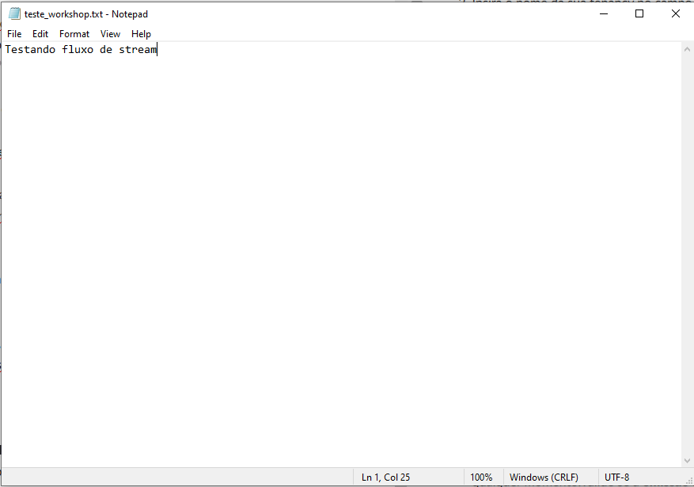

2. Na sua **aba principal** ( Onde temos a página do Bucket "workshop_bucket" aberta ) clique em **Upload**.

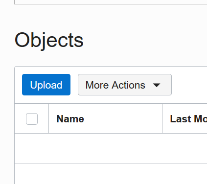

3. No formulário de upload de objetos, clique em **selecionar arquivos** (select files)

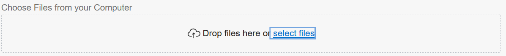

4. Selecione o arquivo **.txt** criado para este teste
5. Clique em **Upload**

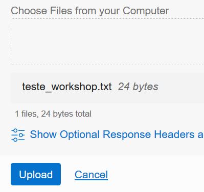

6. **Aguarde o upload do arquivo**, e clique em **Fechar**(Close)
7. **Na nova aba** ( Onde temos a página do fluxo "workshop" aberta) clique em **Carregar Mensagens**(Load Messages). 

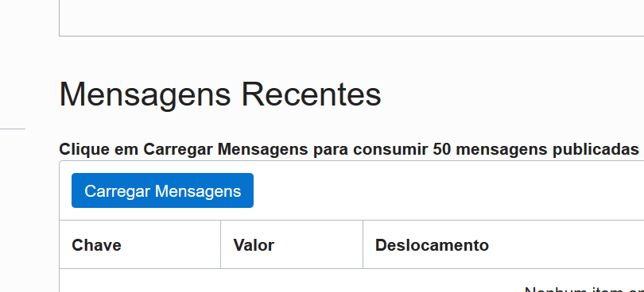

8. Não se preocupe caso nenhum item tenha sido encontrado, este processo pode levar algum tempo visto que é a primeira execução da função. Aguarde alguns segundos e tente  carregar as mensagens novamente se for necessário.

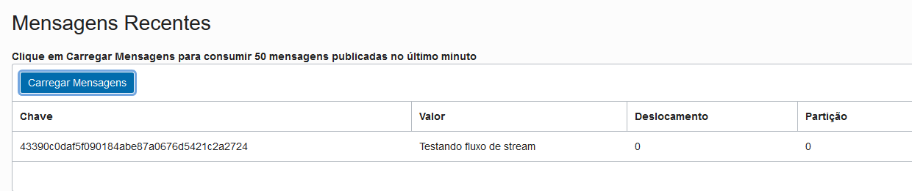

[<--------RETORNAR](../LAB02/README.md)