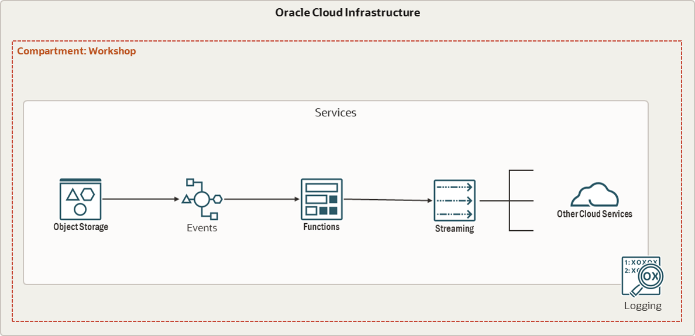

# Lab. #3 - Developing Cloud Native Applications - Parte 2

Esse workshop foi desenvolvido com o intuito de demonstrar as funcionalidades da Oracle Cloud Infrastructure em cenários onde se faz necessário orquestrar sua infraestrutura baseando-se em Eventos. O objetivo final deste workshop, é a criação e implementação do seguinte fluxo de evento:

- 🌀 [Página oficial do Oracle Functions](https://www.oracle.com/br/cloud-native/functions/)
- 🧾 [Documentação do Oracle Functions](https://docs.oracle.com/en-us/iaas/Content/Functions/Concepts/functionsoverview.htm)

- 🌀 [Página oficial do Oracle Events](https://www.oracle.com/br/cloud-native/events-service/)
- 🧾 [Documentação do Oracle Events](https://docs.oracle.com/en-us/iaas/Content/Events/Concepts/eventsoverview.htm)

- 🌀 [Página oficial do Oracle Streaming](https://www.oracle.com/br/cloud-native/streaming/)
- 🧾 [Documentação do Oracle Streaming](https://docs.oracle.com/en-us/iaas/Content/Streaming/Concepts/streamingoverview.htm)

- [LAB 01 - Preparando o Ambiente](./LAB01/README.md)
- [LAB 02 - Functions](./LAB02/README.md)
- [LAB 03 - Events](./LAB03/README.md)